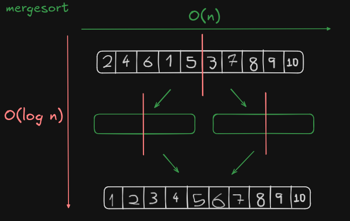
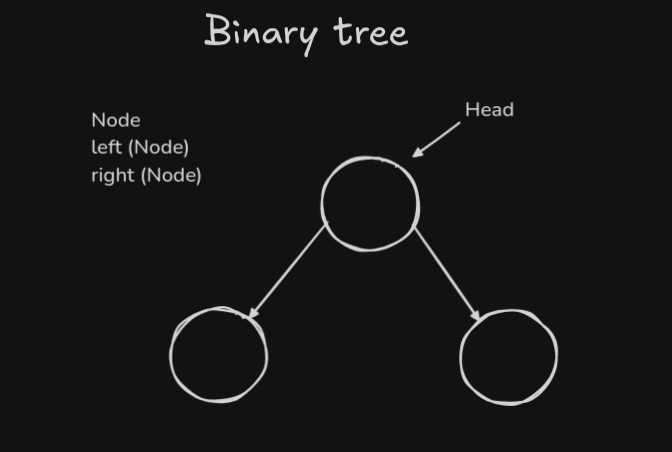
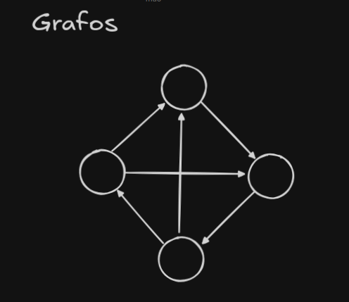
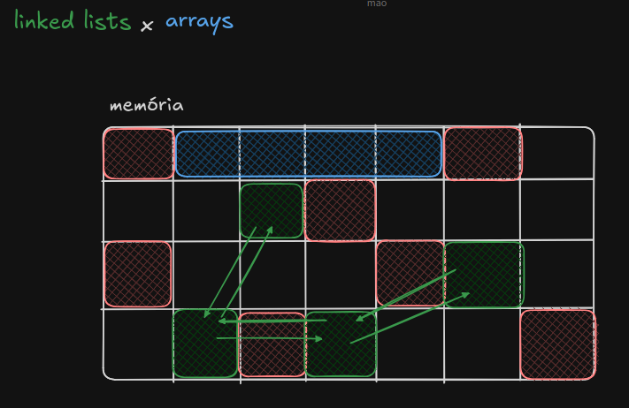
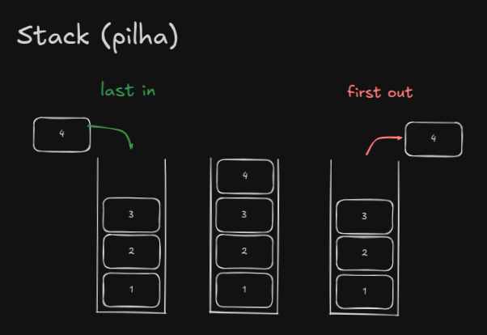

# DSA Project

Este repositório contém anotações e materiais relacionados ao estudo de Data Structures and Algorithms (DSA).

## Conteúdo das Anotações

Abaixo estão algumas anotações que fiz durante o seguimento do curso de DSA do [Algusto Galego](https://hub.la/g/L8wi9vio7WPnWbmF8ZIO).

---

## Array

* Espaço contido na memória que armazena elementos

* Exemplo - [ 0000111100001111 ]
        -

        1. Pode ser interpretado como um array de 4 elementos com 4 bits cada: **[0000, 1111, 0000, 1111]**

        2. Pode ser interpretado como um array de 2 elementos com 8 bits cada: **[00001111, 00001111]**

        3. Pode ser interpretado como um array de 1 elemento com 16 bits cada: **[0000111100001111]**

* Acesso por índice: Rápido, O(1), porque você vai direto à posição correta.

* Inserir ou remover no meio: O(n), porque você precisa deslocar os itens para abrir espaço ou preencher o vazio. Talvez seja necessário mover o array inteiro dependendo da disposição da memória.

~~~javascript
//javascript
//isso não é um array
let a = []
~~~

* Em javascript um array é um objeto mais complexo onde não é preciso estabelecer um tamanho fixo de elemenetos nem especificar seus tipos.

* Arrays em javascript são mutaveis, podendo adicionar e remover itens.

~~~rust
//rust
//rust
let my_array: [i32; 4] = [1,2,3,4]
~~~

* Arrays em rust não são mutaveis, ou seja, não é possivel adicionar e remover itens após sua inicialização. Então é necessário expecificar o tamanho do array, que nesse caso foi 4 elementos.

---

## Big O Notation

* Big O é uma forma de denotar o desempenho de um algoritmo.
* Mas não é, necessariamente, uma medida de performance.
* Se refere a escalabilidade de um algoritmo em relação ao *input*.
* Pode ser usado para medir a complexidade **espacial** e a complexidade **temporal** de um algoritmo.

### Complexidade Temporal e Espacial

* Complexidade temporal diz respeito ao tempo de execução de um algoritmo enquanto a complexidade espacial diz respeito ao quando de memória adicioal precisa ser alocada.

* **Exemplo:** Em um algoritmo onde dado um *array* ele procura o maior item, sua complexidade **temporal** será **O(n)**, pois, o algoritmo precisará percorrer *n* vezes o *array* para encontrar o maior valor. Onde *n* sendo o tamanho desse *array*.

    .png)

    Porém, nesse algoritmo a complexidade **espacial** será **O(1)**, pois, apenas um espaço na memória foi alocado para armazenar o maior valor encontrado.

    .png)

## Principais Notações - Da melhor para a pior escalabilidade

### O(1) - Constante

* **Tempo:** Encontrar o primeiro elemeneto de um *array*. Independente do tamanho desse *array*, o tempo de execução será constante.

* **Memoria:** Armazenar os 15 maiores elementos de um *array*. Independente do tamnho do *array*, sempre será armazenado 15 valores.

### O(log n) - Enquanto o input aumenta exponencialmente o tempo aumenta linearmente

* **Exemplo:** Algoritmo de Busca Binária

### O(n) - Conforme o input aumenta o tempo aumenta na mesma medida

### O(n log n)

* **Exemplo:** Algoritmo de Ordenação (quicksort, mergesort) e algoritmos divide and conquer

    

### O(n²) - Para cada item do *array* ele checa todos os outro itens

* **Exemplo:** Bubble sort ou geralmente um loop dentro de outro loop

~~~python
for i in arr:
        for j in arr:
~~~

for i in arr:
        for j in arr:

### O(n!)

---

## Binary Trees (Árvores Binárias)

Estrutura de dados constituida de nós (*nodes*) onde cada nó aponta para dois nós filhos (*left* e *right*).

---

## Grafos

Estrutura de dados constituida de nós que são ligados por vértices.

Suas vértices podem ter valores. Por exemplo, cada nó representar cidades e suas vértices a distância entre elas.

---

## Hashmap

Dicionário, armazena chave/valor.

* Inserir, remover ou buscar um item: Geralmente muito rápido, O(1), porque você vai direto ao compartimento certo. Mas no pior caso, pode ser O(n) se muitos itens forem para o mesmo compartimento (colisões).

---

## Linked Lists

Cada vagão nó carrega um item e sabe quem é o próximo nó. Para percorrer os itens, você começa na ***head*** e vai percorrer de nó em nó.

* Inserir ou remover no início: Muito rápido, O(1). Só inserir o novo item e alterar o ponteiro de ***head*** ou ***tail***.

* Acesso ao item específico: Lento, O(n), porque você precisa passar por cada nó até chegar ao que quer.

* Inserir ou remover no meio ou fim: Lento, O(n), porque você precisa percorrer a lista para chegar no ponto desejado.

---

## Queue (fila)

* Fila é uma estrutura de dados que segue a regra **FIFO (*first in first out*)** onde o primeiro item que entrar na fila vai ser o primeiro a sair da fila.

* Utilizada para fazer ***buffering*** e ***streaming*** de dados por exemplo.

* Tradicionalmente é implementada utilizando **Linked Lists**.

## Dequeue (fila duplamente terminada)

* É implementada com uma **doubly linked list**.

* Não segue necessariamente a regra **FIFO**.

---

## Stack (pilha)

Pilha em estrutura de dados segue a regra **LIFO (*last in first out*)** onde o último elemento adicionado na pilha é o primeiro a sair dela. Por isso tem a noção de empilhar os itens.

---
